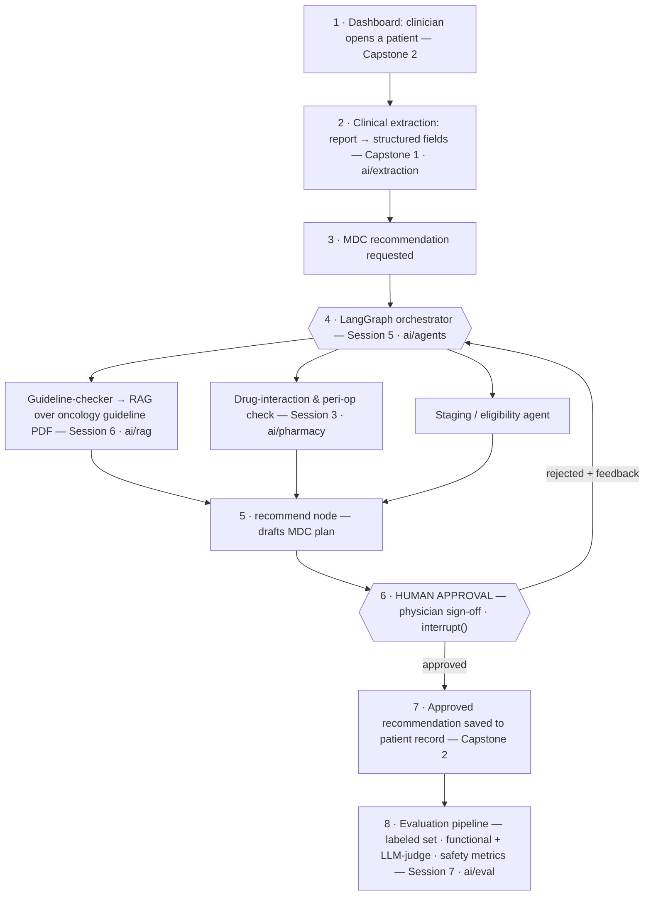

# Integrated System Architecture — Surgical Oncology Patient Flow Dashboard

**Repository:** https://github.com/Tuqaghazawi/team-dashboard

**Vision:** a single dashboard for the surgical-oncology patient journey where, for each patient, the AI modules draft an MDC recommendation — grounded in guidelines, checked for medication and staging issues — and hold it for physician sign-off before anything is recorded. The course assignments are the modules of this one system, not separate exercises.

## The system in one flow

## Modules — what each assignment contributes

| Session | Module | Repo path | Role in the system | Status |
|---|---|---|---|---|
| Capstone 1 | Clinical extraction | `ai/extraction/` | pathology report → structured fields | ✅ built (313/313) |
| Session 3 | Pharmacy pipeline | `ai/pharmacy/` | meds → SQL, interaction extraction, text-to-SQL, peri-op CDS flag | ✅ built |
| Session 6 | RAG guideline brain | `ai/rag/` | retrieves oncology-guideline passages to ground MDC recommendations | ⬜ to build |
| Session 5 | LangGraph orchestrator | `ai/agents/` | routes specialist agents; holds the recommendation for human approval | ⬜ to build |
| Capstone 2 | Dashboard | repo root | patient flow, roles, MDC view, the Approve/Reject sign-off UI | 🔧 in progress |
| Session 7 | Evaluation | `ai/eval/` | labeled dataset, functional + LLM-judge evaluators, clinical safety metrics | ⬜ to build |

## The end-to-end MDC slice (the integration story)

1. A clinician opens a patient in the **dashboard** (Capstone 2).
2. **Clinical extraction** (Capstone 1) turns the free-text pathology report into structured fields.
3. An **MDC recommendation** is requested for that patient.
4. The **LangGraph orchestrator** (Session 5) routes the case to specialist agents:
   - a **guideline-checker** that queries the **RAG** system over the oncology guideline PDF (Session 6),
   - a **drug-interaction / peri-op** agent reusing the pharmacy pipeline (Session 3),
   - a **staging / eligibility** agent.
5. A **recommend node** drafts the MDC plan from the agents' findings.
6. The draft is **held for physician sign-off** via `interrupt()` — in the dashboard this is an **Approve / Reject** button. Reject loops back to the orchestrator with the physician's feedback.
7. The **approved** recommendation is saved to the patient record.
8. The whole path is scored by the **evaluation pipeline** (Session 7).

## Shared design principles (why it is one system, not four)

- **Pydantic schemas as the contract** — the schema that validates an AI output is the shape the dashboard stores. One contract, both ends.
- **Human-in-the-loop by design** — no recommendation is recorded without physician sign-off; the `interrupt()` gate is the safety spine, not a feature.
- **Synthetic data only** — a safe prototype; real records and PHI stay out until governance allows.
- **Secrets excluded from version control** — API keys live in a local `.env`, ignored by git.
- **Guideline provenance** — retrieved guidance carries its source and version, so advice is auditable and staleness is visible.
